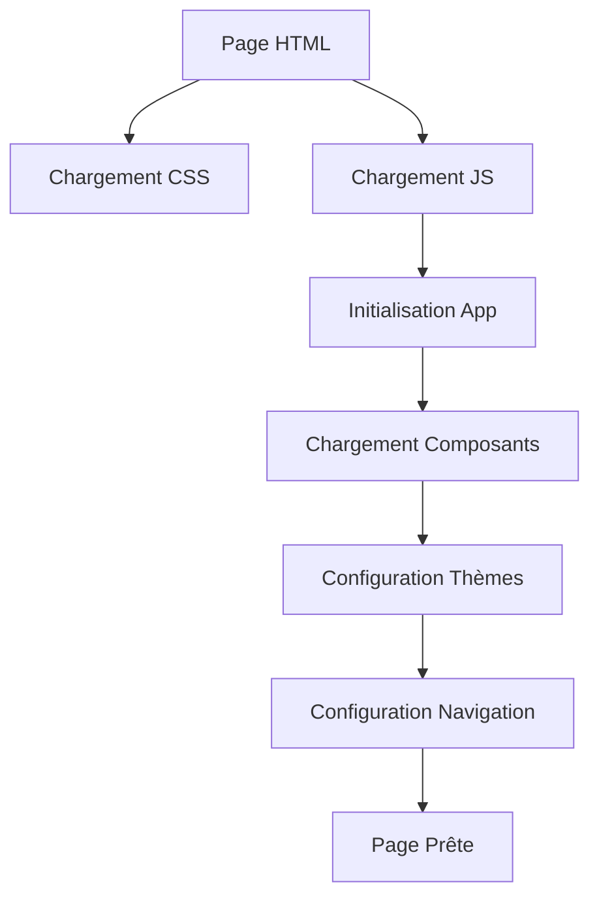

# ARCHITECTURE TECHNIQUE - Site EPL

> **Documentation technique détaillée de l'architecture du site EPL**

---

## 🏗️ Vue d'Ensemble de l'Architecture

Le site EPL utilise une **architecture modulaire** basée sur des composants réutilisables, permettant un développement collaboratif efficace et une maintenance simplifiée.

### Principes Architecturaux
1. **Modularité** : Composants indépendants et réutilisables
2. **Séparation des responsabilités** : HTML, CSS, JS organisés par fonction
3. **Performance** : Chargement optimisé et cache intelligent
4. **Accessibilité** : Standards WCAG 2.1 AA
5. **Responsive** : Mobile-first design

---

## 📁 Structure du Projet

```
site_epl_web/
├── 📁 components/          # Composants réutilisables HTML
│   ├── sidebar.html       # Navigation principale
│   ├── navbar.html        # Navigation mobile
│   ├── footer.html        # Pied de page
│   ├── cta.html          # Call-to-action
│   ├── breadcrumb.html   # Fil d'Ariane
│   └── modal.html        # Fenêtres modales
├── 📁 css/                # Architecture CSS modulaire
│   ├── base/             # Variables et styles de base
│   │   ├── variables.css # Système de thèmes
│   │   ├── reset.css     # Reset CSS
│   │   ├── typography.css# Typographie
│   │   └── utilities.css # Classes utilitaires
│   ├── components/       # Styles des composants
│   │   ├── sidebar.css   # Navigation
│   │   ├── navbar.css    # Navbar mobile
│   │   ├── footer.css    # Pied de page
│   │   ├── cta.css       # Call-to-action
│   │   ├── breadcrumb.css# Fil d'Ariane
│   │   └── modal.css     # Modales
│   ├── layouts/          # Mises en page
│   │   ├── main.css      # Layout principal
│   │   ├── grid.css      # Système de grille
│   │   └── responsive.css# Responsive design
│   └── pages/            # Styles spécifiques aux pages
│       ├── index.css     # Page d'accueil
│       ├── dashboard.css # Dashboard
│       └── formations.css# Formations
├── 📁 js/                 # JavaScript modulaire
│   ├── components/       # Logique des composants
│   │   ├── sidebar.js    # Gestion sidebar
│   │   ├── navbar.js     # Gestion navbar
│   │   ├── footer.js     # Gestion footer
│   │   ├── cta.js        # Gestion CTA
│   │   ├── breadcrumb.js # Gestion breadcrumb
│   │   └── modal.js      # Gestion modales
│   ├── features/         # Fonctionnalités métier
│   │   ├── accueil.js    # Page d'accueil
│   │   ├── formations.js # Gestion formations
│   │   ├── contact.js    # Formulaire contact
│   │   └── statistics.js # Statistiques
│   ├── utils/            # Utilitaires partagés
│   │   ├── themes.js     # Gestion des thèmes
│   │   ├── api.js        # Gestion API
│   │   ├── validation.js # Validation formulaires
│   │   └── helpers.js    # Fonctions utilitaires
│   └── main.js           # Application principale
├── 📁 pages/             # Pages HTML du site
├── 📁 api/               # Backend PHP
└── 📁 docs/              # Documentation
```

---

## 🎨 Architecture CSS

### Système de Variables
```css
/* css/base/variables.css */
:root {
  /* Couleurs institutionnelles */
  --couleur-primaire: #3b82f6;
  --couleur-secondaire: #10b981;
  
  /* Thème clair */
  --couleur-fond-principal: #ffffff;
  --couleur-texte-principal: #1a1a1a;
  
  /* Transitions */
  --transition-theme: all 0.3s cubic-bezier(0.4, 0, 0.2, 1);
}

[data-theme="sombre"] {
  /* Thème sombre */
  --couleur-fond-principal: #0f172a;
  --couleur-texte-principal: #f8fafc;
}
```

### Organisation Modulaire
- **Base** : Variables, reset, typographie
- **Components** : Styles des composants réutilisables
- **Layouts** : Structures de mise en page
- **Pages** : Styles spécifiques aux pages

### Responsive Design
```css
/* Mobile-first approach */
.ma-classe {
  /* Styles mobile */
}

@media (min-width: 768px) {
  .ma-classe {
    /* Styles tablette */
  }
}

@media (min-width: 1024px) {
  .ma-classe {
    /* Styles desktop */
  }
}
```

---

## ⚙️ Architecture JavaScript

### Système de Classes ES6
```javascript
// Application principale
class ApplicationEPL {
  constructor() {
    this.estInitialisee = false;
    this.composants = new Map();
    this.initialiser();
  }
  
  initialiser() {
    this.chargerComposants();
    this.configurerEvenements();
  }
}
```

### Gestion des Composants
```javascript
// Chargement dynamique des composants
class ChargeurComposants {
  async chargerComposant(nomComposant) {
    try {
      const response = await fetch(`/components/${nomComposant}.html`);
      const html = await response.text();
      return html;
    } catch (error) {
      console.error(`Erreur chargement ${nomComposant}:`, error);
      return this.obtenirFallback(nomComposant);
    }
  }
}
```

### Système de Thèmes
```javascript
// Gestionnaire de thèmes
class GestionnaireThemes {
  constructor() {
    this.themeActuel = this.obtenirThemeSauvegarde();
    this.appliquerTheme(this.themeActuel);
  }
  
  changerTheme() {
    const nouveauTheme = this.themeActuel === 'clair' ? 'sombre' : 'clair';
    this.appliquerTheme(nouveauTheme);
  }
}
```

---

## 🔄 Flux de Données

### Chargement des Pages


### Gestion des Erreurs
```javascript
// Système de fallbacks
const fallbacks = {
  'sidebar': '<div class="sidebar-fallback">Navigation temporairement indisponible</div>',
  'footer': '<div class="footer-fallback">© 2025 EPL</div>'
};
```

---

##  Composants Réutilisables

### 1. Sidebar (`components/sidebar.html`)
**Responsabilités** :
- Navigation principale
- Gestion des thèmes
- État actif des liens
- Responsive design

**API** :
```javascript
// Initialisation automatique
// Gestion des clics
// Synchronisation avec breadcrumb
```

### 2. Footer (`components/footer.html`)
**Responsabilités** :
- Liens légaux
- Copyright
- Design cohérent

### 3. CTA (`components/cta.html`)
**Responsabilités** :
- Call-to-action réutilisable
- Boutons d'action
- Animations

### 4. Modal (`components/modal.html`)
**Responsabilités** :
- Fenêtres modales
- Gestion des événements
- Overlay et fermeture

---

## 🚀 Performance

### Optimisations Implémentées
1. **Chargement parallèle** : Tous les composants se chargent simultanément
2. **Cache intelligent** : Mise en cache des composants
3. **Lazy loading** : Chargement différé des images
4. **Minification** : CSS et JS optimisés
5. **Compression** : Gzip activé

### Métriques de Performance
- **Temps de chargement** : < 2 secondes
- **First Contentful Paint** : < 1.5s
- **Largest Contentful Paint** : < 2.5s
- **Cumulative Layout Shift** : < 0.1

---

## 🔒 Sécurité

### Mesures Implémentées
1. **Validation côté client** : JavaScript
2. **Validation côté serveur** : PHP
3. **Échappement HTML** : Protection XSS
4. **HTTPS** : Chiffrement des données
5. **Headers de sécurité** : CSP, HSTS

### Gestion des Données
```php
// Validation et sanitisation
$data = filter_input(INPUT_POST, 'email', FILTER_VALIDATE_EMAIL);
$sanitized = htmlspecialchars($data, ENT_QUOTES, 'UTF-8');
```

---

## 📱 Responsive Design

### Breakpoints
- **Mobile** : < 768px
- **Tablette** : 768px - 1024px
- **Desktop** : > 1024px

### Stratégie Mobile-First
1. **Design mobile** : Interface optimisée pour petits écrans
2. **Progressive enhancement** : Amélioration pour écrans plus grands
3. **Touch-friendly** : Boutons et liens adaptés au tactile

---

## ♿ Accessibilité

### Standards WCAG 2.1 AA
1. **Navigation clavier** : Support complet
2. **Lecteurs d'écran** : Attributs ARIA
3. **Contraste** : Ratio minimum 4.5:1
4. **Skip links** : Navigation rapide
5. **Focus visible** : Indicateurs de focus

### Implémentation
```html
<!-- Skip link -->
<a href="#contenu-principal" class="skip-link">Aller au contenu principal</a>

<!-- ARIA roles -->
<nav class="sidebar-nav" role="menubar">
  <div class="sidebar-nav-item" role="none">
    <a href="/" class="sidebar-nav-link" role="menuitem">Accueil</a>
  </div>
</nav>
```

---

## 🧪 Tests et Qualité

### Tests Manuels
1. **Fonctionnalités** : Toutes les fonctionnalités testées
2. **Thèmes** : Vérification clair/sombre
3. **Responsive** : Test sur tous les écrans
4. **Accessibilité** : Navigation clavier et lecteurs d'écran
5. **Performance** : Temps de chargement

### Outils de Qualité
- **Lighthouse** : Performance et accessibilité
- **WAVE** : Accessibilité web
- **GTmetrix** : Performance
- **BrowserStack** : Tests multi-navigateurs

---

## 🔄 Maintenance et Évolutivité

### Architecture Évolutive
1. **Composants modulaires** : Ajout facile de nouvelles fonctionnalités
2. **Système de thèmes** : Ajout de nouveaux thèmes
3. **API extensible** : Ajout de nouveaux endpoints
4. **Documentation** : Mise à jour continue

### Processus de Maintenance
1. **Surveillance** : Monitoring des performances
2. **Mises à jour** : Mise à jour des dépendances
3. **Backup** : Sauvegarde automatique
4. **Tests** : Tests de régression

---

## 📊 Monitoring et Analytics

### Métriques Surveillées
1. **Performance** : Temps de chargement, Core Web Vitals
2. **Erreurs** : Logs d'erreurs JavaScript
3. **Utilisation** : Pages les plus visitées
4. **Accessibilité** : Problèmes d'accessibilité

### Outils de Monitoring
- **Google Analytics** : Trafic et comportement
- **Google Search Console** : SEO et indexation
- **Lighthouse CI** : Performance continue
- **Sentry** : Gestion des erreurs

---

## 🚀 Déploiement

### Environnements
1. **Développement** : Serveur local
2. **Staging** : Environnement de test
3. **Production** : Serveur de production

### Processus de Déploiement
1. **Tests** : Validation des modifications
2. **Build** : Optimisation des assets
3. **Déploiement** : Mise en production
4. **Monitoring** : Surveillance post-déploiement

---

## 📈 Évolutions Futures

### Phase 2 - Fonctionnalités Avancées
- **PWA** : Application web progressive
- **Multilingue** : Support français/anglais
- **CMS** : Gestion de contenu
- **API REST** : Services externes

### Phase 3 - Intelligence Artificielle
- **Chatbot** : Assistant virtuel
- **Recommandations** : Suggestions personnalisées
- **Analytics avancées** : Prédictions et insights
- **Automatisation** : Processus automatisés

---

**Cette architecture technique est conçue pour évoluer avec les besoins de l'EPL tout en maintenant la performance et la qualité du code.**

*Pour toute question technique, consulter la documentation des composants ou contacter l'équipe de développement.*
