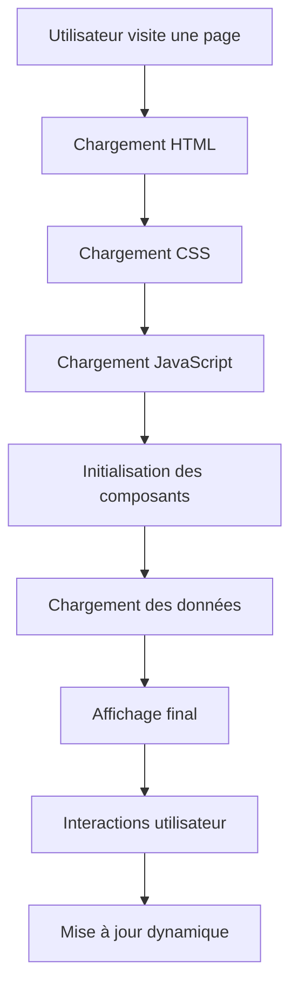
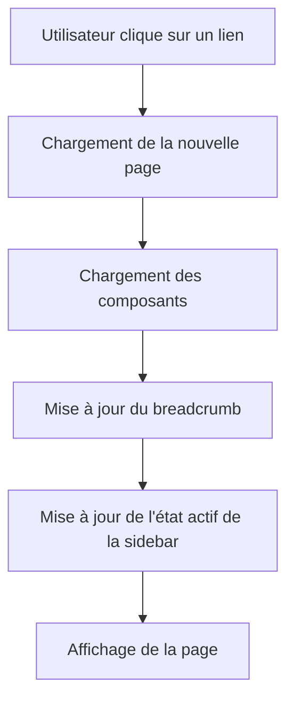

# FONCTIONNEMENT GLOBAL DU SITE EPL

> **Explication complète du fonctionnement du site EPL, des composants et de l'architecture**

---

##  VUE D'ENSEMBLE DU FONCTIONNEMENT

Le site EPL fonctionne comme une **machine bien huilée** où chaque composant a un rôle précis et communique avec les autres pour créer une expérience utilisateur cohérente.

### Principe Fondamental
```
UTILISATEUR → PAGE HTML → COMPOSANTS → JAVASCRIPT → THÈMES → AFFICHAGE
```

---

##  ARCHITECTURE GLOBALE

### 1. **Structure en Couches**

```
┌─────────────────────────────────────────┐
│           COUCHE PRÉSENTATION          │
│  (HTML + CSS + Composants visuels)     │
├─────────────────────────────────────────┤
│           COUCHE LOGIQUE               │
│  (JavaScript + Gestion des composants) │
├─────────────────────────────────────────┤
│           COUCHE DONNÉES               │
│  (API + JSON + Base de données)        │
├─────────────────────────────────────────┤
│           COUCHE INFRASTRUCTURE        │
│  (Serveur + Cache + Performance)       │
└─────────────────────────────────────────┘
```

### 2. **Flux de Données**



---

##  COMPOSANTS RÉUTILISABLES - FONCTIONNEMENT DÉTAILLÉ

### 1. **Sidebar** (`components/sidebar.html`)

#### **Rôle Principal**
- **Navigation principale** du site
- **Gestion des thèmes** (bouton clair/sombre)
- **État actif** des liens de navigation
- **Responsive** (se transforme en menu hamburger sur mobile)

#### **Comment ça fonctionne**
```javascript
// 1. Chargement automatique
fetch('/components/sidebar.html')
  .then(response => response.text())
  .then(html => {
    document.getElementById('sidebar-container').innerHTML = html;
  });

// 2. Gestion des clics
document.addEventListener('click', function(e) {
  if (e.target.classList.contains('sidebar-nav-link')) {
    // Navigation vers la page
    window.location.href = e.target.href;
  }
});

// 3. Gestion du thème
document.getElementById('bouton-theme').addEventListener('click', function() {
  gestionnaireThemes.changerTheme();
});
```

#### **Dépendances**
- **CSS** : `/css/components/sidebar.css`
- **JS** : `/js/components/sidebar.js`
- **Thèmes** : `/js/utils/themes.js`

---

### 2. **Navbar** (`components/navbar.html`)

#### **Rôle Principal**
- **Navigation mobile** uniquement
- **Logo EPL** centré
- **Menu hamburger** pour la navigation
- **Bouton de thème** mobile

#### **Comment ça fonctionne**
```javascript
// Affichage conditionnel (mobile uniquement)
if (window.innerWidth <= 768) {
  // Charger la navbar
  chargerNavbar();
}

// Gestion du menu hamburger
document.getElementById('bouton-menu-mobile').addEventListener('click', function() {
  document.getElementById('menu-mobile').classList.toggle('ouvert');
});
```

#### **Dépendances**
- **CSS** : `/css/components/navbar.css`
- **JS** : `/js/components/navbar.js`

---

### 3. **Footer** (`components/footer.html`)

#### **Rôle Principal**
- **Pied de page** standardisé
- **Liens légaux** (mentions, politique de confidentialité)
- **Copyright** EPL
- **Design cohérent** sur toutes les pages

#### **Comment ça fonctionne**
```javascript
// Chargement simple
fetch('/components/footer.html')
  .then(response => response.text())
  .then(html => {
    document.getElementById('footer-container').innerHTML = html;
  });
```

#### **Dépendances**
- **CSS** : `/css/components/footer.css`

---

### 4. **Breadcrumb** (`components/breadcrumb.html`)

#### **Rôle Principal**
- **Navigation contextuelle** (fil d'Ariane)
- **Icônes** pour chaque page
- **Liens de navigation** hiérarchiques
- **Centré et stylisé**

#### **Comment ça fonctionne**
```javascript
// Détection de la page actuelle
const pageActuelle = window.location.pathname.split('/').pop().replace('.html', '');

// Génération du breadcrumb
const breadcrumb = genererBreadcrumb(pageActuelle);

// Affichage
document.getElementById('breadcrumb-container').innerHTML = breadcrumb;
```

#### **Dépendances**
- **CSS** : `/css/components/breadcrumb.css`
- **JS** : `/js/components/breadcrumb.js`

---

### 5. **CTA** (`components/cta.html`)

#### **Rôle Principal**
- **Call-to-action** réutilisable
- **Boutons d'action** (formations, contact)
- **Animations** et effets visuels
- **Design responsive**

#### **Comment ça fonctionne**
```javascript
// Chargement avec configuration
const ctaConfig = {
  titre: "Prêt à rejoindre l'excellence ?",
  description: "Découvrez nos formations...",
  boutons: [
    { texte: "Découvrir nos formations", lien: "/formations" },
    { texte: "Nous contacter", lien: "/contact" }
  ]
};

genererCTA(ctaConfig);
```

#### **Dépendances**
- **CSS** : `/css/components/cta.css`
- **JS** : `/js/components/cta.js`

---

### 6. **Modal** (`components/modal.html`)

#### **Rôle Principal**
- **Fenêtres modales** réutilisables
- **Boutons personnalisables**
- **Overlay** avec fermeture
- **Animations** fluides

#### **Comment ça fonctionne**
```javascript
// Création d'une modal
const modal = new GestionnaireModal();

// Ouverture
modal.ouvrir(
  'Titre de la modal',
  'Contenu HTML',
  [
    { texte: 'Annuler', action: 'fermer' },
    { texte: 'Confirmer', action: 'confirmer', classe: 'bouton-primaire' }
  ]
);

// Fermeture
modal.fermer();
```

#### **Dépendances**
- **CSS** : `/css/components/modal.css`
- **JS** : `/js/components/modal.js`

---

## 🎨 SYSTÈME DE THÈMES - FONCTIONNEMENT

### 1. **Variables CSS** (`css/base/variables.css`)

#### **Comment ça fonctionne**
```css
/* Thème clair par défaut */
:root {
  --couleur-fond-principal: #ffffff;
  --couleur-texte-principal: #1a1a1a;
  --couleur-accent: #3b82f6;
}

/* Thème sombre */
[data-theme="sombre"] {
  --couleur-fond-principal: #0f172a;
  --couleur-texte-principal: #f8fafc;
  --couleur-accent: #60a5fa;
}
```

#### **Avantages**
- **Changement instantané** : Pas de rechargement de page
- **Cohérence** : Tous les composants utilisent les mêmes variables
- **Performance** : Pas de JavaScript lourd

---

### 2. **Gestionnaire JavaScript** (`js/utils/themes.js`)

#### **Comment ça fonctionne**
```javascript
class GestionnaireThemes {
  constructor() {
    this.themeActuel = this.obtenirThemeSauvegarde();
    this.appliquerTheme(this.themeActuel);
  }
  
  changerTheme() {
    const nouveauTheme = this.themeActuel === 'clair' ? 'sombre' : 'clair';
    this.appliquerTheme(nouveauTheme);
  }
  
  appliquerTheme(theme) {
    // Applique l'attribut data-theme sur <html>
    document.documentElement.setAttribute('data-theme', theme);
    
    // Sauvegarde dans localStorage
    localStorage.setItem('theme-prefere-epl', theme);
    
    // Émet un événement pour synchroniser les composants
    window.dispatchEvent(new CustomEvent('changement-theme', {
      detail: { theme: theme }
    }));
  }
}
```

#### **Synchronisation**
- **Tous les composants** écoutent l'événement `changement-theme`
- **Mise à jour automatique** des icônes et styles
- **Persistance** du choix utilisateur

---

## 📱 RESPONSIVE DESIGN - FONCTIONNEMENT

### 1. **Approche Mobile-First**

```css
/* Mobile par défaut */
.ma-classe {
  font-size: 14px;
  padding: 10px;
}

/* Tablette */
@media (min-width: 768px) {
  .ma-classe {
    font-size: 16px;
    padding: 20px;
  }
}

/* Desktop */
@media (min-width: 1024px) {
  .ma-classe {
    font-size: 18px;
    padding: 30px;
  }
}
```

### 2. **Composants Responsive**

#### **Sidebar**
- **Desktop** : Toujours visible à gauche
- **Mobile** : Menu hamburger avec overlay

#### **Navbar**
- **Desktop** : Masquée (sidebar visible)
- **Mobile** : Visible en haut

#### **Grilles**
- **Mobile** : 1 colonne
- **Tablette** : 2 colonnes
- **Desktop** : 3+ colonnes

---

## ⚡ PERFORMANCE - FONCTIONNEMENT

### 1. **Chargement Optimisé**

```javascript
// Chargement parallèle des composants
const composants = ['sidebar', 'footer', 'breadcrumb', 'cta'];
const promesses = composants.map(composant => 
  fetch(`/components/${composant}.html`)
    .then(response => response.text())
);

Promise.all(promesses).then(htmls => {
  // Tous les composants chargés en même temps
  htmls.forEach((html, index) => {
    const container = document.getElementById(`${composants[index]}-container`);
    if (container) container.innerHTML = html;
  });
});
```

### 2. **Cache Intelligent**

```javascript
// Cache des composants
const cacheComposants = new Map();

async function chargerComposant(nom) {
  if (cacheComposants.has(nom)) {
    return cacheComposants.get(nom);
  }
  
  const response = await fetch(`/components/${nom}.html`);
  const html = await response.text();
  cacheComposants.set(nom, html);
  return html;
}
```

### 3. **Lazy Loading**

```javascript
// Chargement différé des images
const images = document.querySelectorAll('img[data-src]');
const imageObserver = new IntersectionObserver((entries) => {
  entries.forEach(entry => {
    if (entry.isIntersecting) {
      const img = entry.target;
      img.src = img.dataset.src;
      imageObserver.unobserve(img);
    }
  });
});

images.forEach(img => imageObserver.observe(img));
```

---

## 🔄 FLUX DE NAVIGATION

### 1. **Navigation entre Pages**



### 2. **Gestion des États**

```javascript
// Mise à jour de l'état actif
function mettreAJourNavigation(pageActuelle) {
  // Retirer la classe 'actif' de tous les liens
  document.querySelectorAll('.sidebar-nav-link').forEach(link => {
    link.classList.remove('actif');
  });
  
  // Ajouter la classe 'actif' au lien de la page actuelle
  const lienActif = document.querySelector(`a[href="/pages/${pageActuelle}.html"]`);
  if (lienActif) {
    lienActif.classList.add('actif');
  }
}
```

---

## 🛠️ GESTION DES ERREURS

### 1. **Fallbacks Automatiques**

```javascript
// Fallback en cas d'erreur de chargement
const fallbacks = {
  'sidebar': '<div class="sidebar-fallback">Navigation temporairement indisponible</div>',
  'footer': '<div class="footer-fallback">© 2025 EPL</div>',
  'breadcrumb': '<div class="breadcrumb-fallback">Navigation contextuelle</div>'
};

async function chargerComposantAvecFallback(nom) {
  try {
    const response = await fetch(`/components/${nom}.html`);
    if (!response.ok) throw new Error('Erreur de chargement');
    return await response.text();
  } catch (error) {
    console.warn(`Fallback pour ${nom}:`, error);
    return fallbacks[nom] || `<div class="composant-erreur">Erreur de chargement</div>`;
  }
}
```

### 2. **Retry Automatique**

```javascript
// Retry avec délai progressif
async function chargerAvecRetry(url, maxTentatives = 3) {
  for (let i = 0; i < maxTentatives; i++) {
    try {
      const response = await fetch(url);
      if (response.ok) return await response.text();
    } catch (error) {
      if (i === maxTentatives - 1) throw error;
      await new Promise(resolve => setTimeout(resolve, 1000 * (i + 1)));
    }
  }
}
```

---

## 🔍 DEBUG ET MONITORING

### 1. **Logs Détaillés**

```javascript
// Système de logs avec emojis
console.log('🚀 Initialisation de l\'application');
console.log('✅ Composant chargé:', nomComposant);
console.log('❌ Erreur de chargement:', error);
console.log('🔄 Retry automatique...');
console.log('🎨 Thème changé vers:', theme);
```

### 2. **Monitoring des Performances**

```javascript
// Mesure du temps de chargement
const startTime = performance.now();

// ... chargement des composants ...

const endTime = performance.now();
console.log(`⏱️ Temps de chargement: ${endTime - startTime}ms`);
```

---

## 📊 MÉTRIQUES ET ANALYTICS

### 1. **Métriques Techniques**

- **Temps de chargement** : < 2 secondes
- **First Contentful Paint** : < 1.5s
- **Largest Contentful Paint** : < 2.5s
- **Cumulative Layout Shift** : < 0.1

### 2. **Métriques Utilisateur**

- **Pages vues** : Suivi des pages les plus visitées
- **Temps passé** : Engagement utilisateur
- **Taux de rebond** : Qualité du contenu
- **Conversions** : Inscriptions, contacts

---

## 🚀 ÉVOLUTIONS ET MAINTENANCE

### 1. **Ajout de Nouveaux Composants**

```javascript
// 1. Créer le fichier HTML
// 2. Créer le fichier CSS
// 3. Créer le fichier JS
// 4. Ajouter à la configuration
const nouveauxComposants = ['nouveau-composant'];
```

### 2. **Mise à Jour des Composants**

```javascript
// Invalidation du cache
cacheComposants.delete('nom-composant');

// Rechargement
chargerComposant('nom-composant');
```

### 3. **Maintenance Préventive**

- **Surveillance** des performances
- **Mise à jour** des dépendances
- **Tests** de régression
- **Backup** automatique

---

##  RÉSUMÉ DU FONCTIONNEMENT

### **Le site EPL fonctionne comme un orchestre :**

1. **Conducteur** : `main.js` (application principale)
2. **Musiciens** : Composants réutilisables
3. **Partitions** : CSS et JavaScript modulaires
4. **Salle** : Architecture responsive
5. **Public** : Utilisateurs avec expérience cohérente

### **Avantages de cette architecture :**

- ✅ **Modularité** : Chaque composant est indépendant
- ✅ **Réutilisabilité** : Composants partagés
- ✅ **Maintenabilité** : Modifications centralisées
- ✅ **Performance** : Chargement optimisé
- ✅ **Évolutivité** : Ajout facile de fonctionnalités
- ✅ **Qualité** : Standards respectés

---

**Le site EPL est une machine bien huilée où chaque pièce a son rôle et communique parfaitement avec les autres !**

*Pour toute question sur le fonctionnement, consultez la documentation des composants ou contactez l'équipe de développement.*
